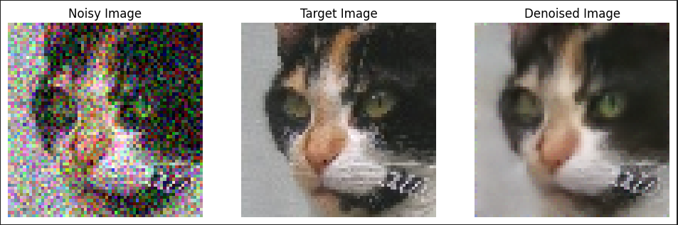
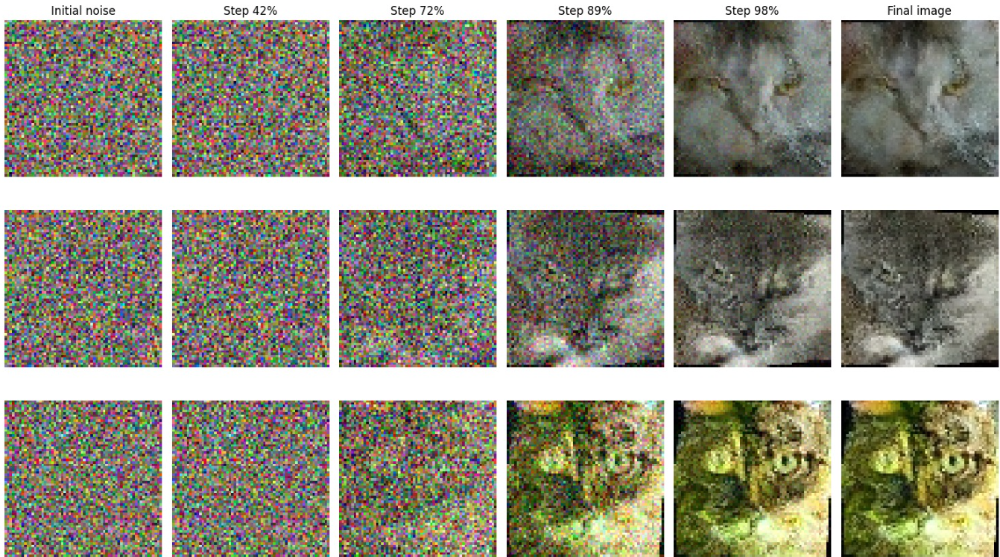
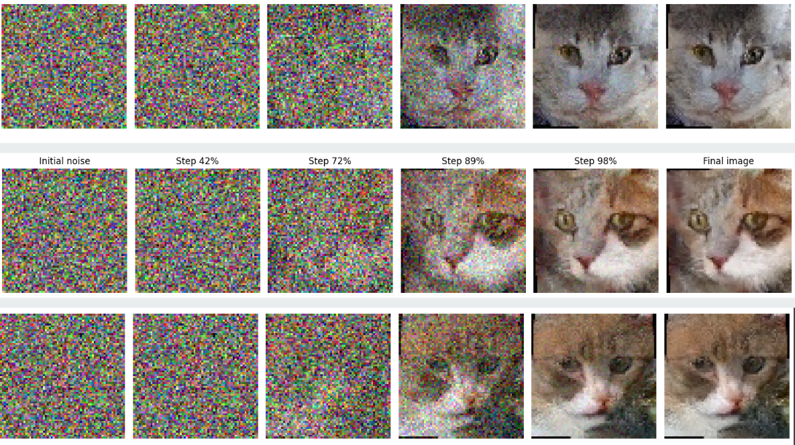

# Autoencoder & Diffusion Models for Image Denoising

This repository explores the use of **autoencoders** and **diffusion models** for image denoising and generation. Leveraging architectures like convolutional autoencoders and U-Net, this project compares different approaches to reduce noise in images while preserving essential features.

## Features

- **Denoising Autoencoders**: Implementations of convolutional and U-Net-based autoencoders.
- **Diffusion Models**: Gradual noise-to-image transformation using diffusion models.
- **Dataset**: Trained on noisy images of cats (64x64, RGB) with controlled noise levels.
- **Loss Functions**: MSE loss functions.

## Example Results

### Autoencoder Results

Results of the U-Net autoencoder trained on noisy cat images for 20 epochs, with a noise level of 0.7 :



### Diffusion Model Results

| Epoch 50 | Epoch 150 |
|:--------:|:---------:|
|  |  |

## Usage

See the 'main.ipynb' notebook for a detailed overview of the project, including training and evaluation of the models.

### Dependencies

See the 'requirements.txt' file for a list of dependencies.

Install dependencies:
```bash
pip install -r requirements.txt